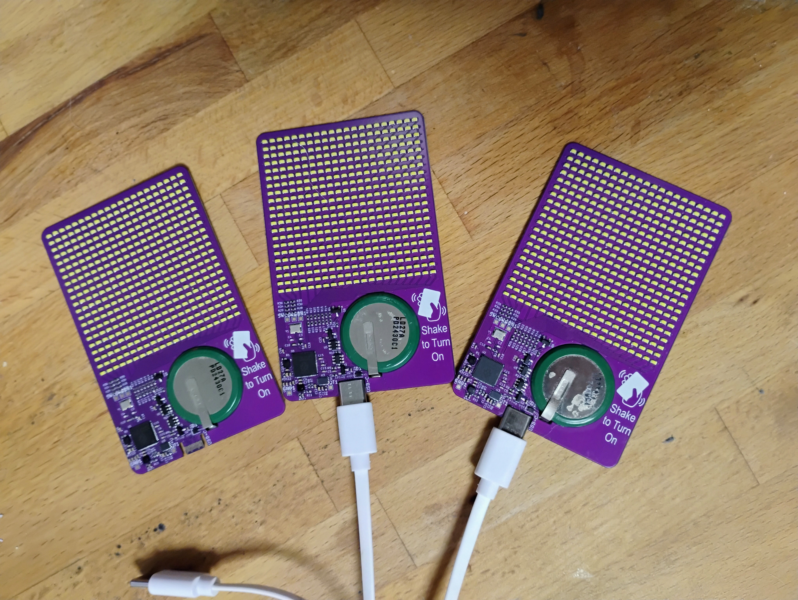
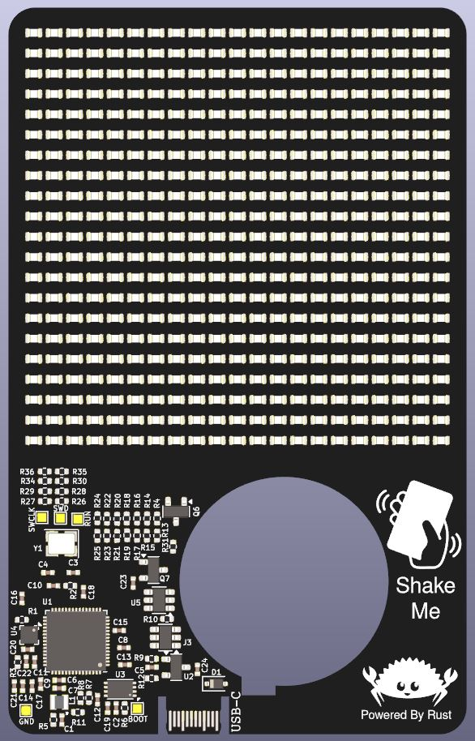

This repo contains all files related to the flip-card project, which is a business card that runs a fluid-implicit-particle(FLIP) simulation.

The PCB design files are in the "kicad-pcb" folder. The flip-card project is inspired by mitxela's fluid simulation pendant project https://mitxela.com/projects/fluid-pendant

The fluid simulation logic is contained in a standalone crate, which is in the "fluid_sim_crate" folder. This is based off the work by Matthias Müller (https://github.com/matthias-research) and his excelent demonstrations on his youtube channel "Ten Minute Physics"

One of the more difficult features was the rechargable battery.  I found a design for a board edge usb-c port from cnlohr's tiny touch lcd project https://github.com/cnlohr/ch32v003_3digit_lcd_usb/

a WASM simulator is also provided in the "sim_display" folder, which is what I use to debug issues in the simulation.

The implementation for the fluid simulation on the rp2350 is in the "flip-card_firmware" file

further details can be found in each folder's README files

